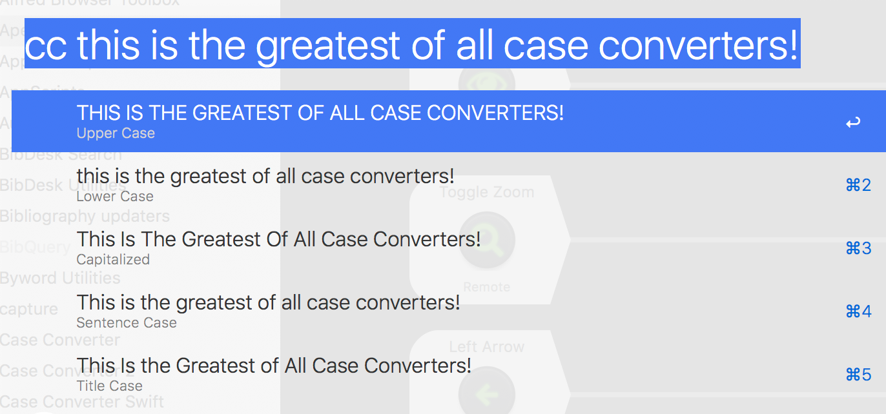

# case converter 3
 Alfred Case Converter workflow

  Now featuring Universal Action triggers and hotkeys for the following five actions:

- Uppercase

- Lowercase

- Capitalize - capitalizes **all** words (e.g. Posting A New Topic In Share Your Workflows)

- Title Case - capitalizes word except for "the", "in", "of" etc. according to American English title conventions (e.g. Posting a New Topic in Share Your Workflows),  If you manage academic citations with BibDesk, Zotero, Papers, Mendeley, etc., Title Case conversion is especially useful for cleaning up downloaded citations.

- Sentence Case - capitalizes only the first letter of the first word & converts the rest to lower case

  

All of these are set to Copy to Clipboard and Paste by default.

  

There's also a script filter **cc** which lets you view the query converted and select your choice (like the [Code Case](https://www.alfredforum.com/topic/4818-code-case/) workflow).

  

You can also connect a hot key directly to the **cc** script filter directly to view the output options without typing the **cc** command and pasting your text.

  

Updated May 3, 2013 with nicer colored icon thanks to mjv ( [http://www.alfredforum.com/user/4384-mjv/](https://www.alfredforum.com/user/4384-mjv/) )

Updated February 5, 2014 to handle Sentence Case and to add a second keyword to paste after conversion.

Updated May 20, 2014 with hotkeys

**Updated March 26, 2022 to use Python 3 for MacOS 12.3 **

No longer uses the Title Case perl script found at <https://raw.github.com/ap/titlecase/master/titlecase> , replaced with 
python version from https://muffinresearch.co.uk/titlecasepy-titlecase-in-python/
 

  
